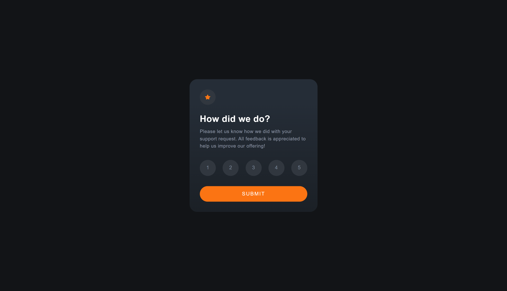
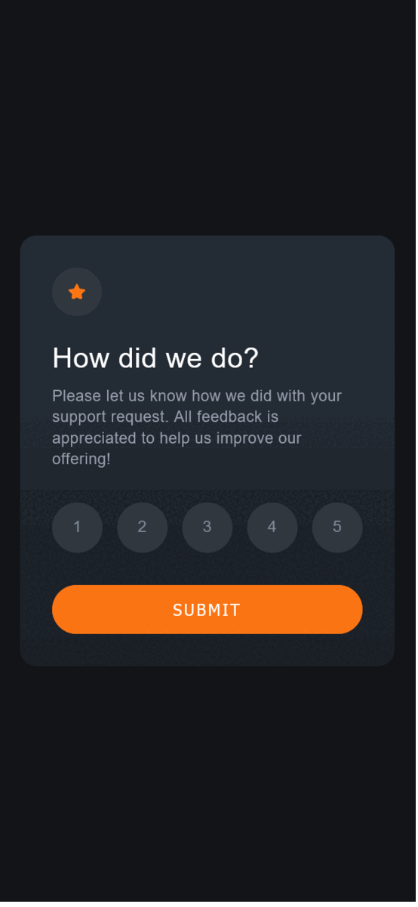

# Frontend Mentor - Interactive rating component solution

This is a solution to the [Interactive rating component challenge on Frontend Mentor](https://www.frontendmentor.io/challenges/interactive-rating-component-koxpeBUmI). Frontend Mentor challenges help you improve your coding skills by building realistic projects.

## Table of contents

-   [Overview](#overview)
    -   [The challenge](#the-challenge)
    -   [Screenshot](#screenshot)
    -   [Links](#links)
-   [My process](#my-process)
    -   [Built with](#built-with)
    -   [What I learned](#what-i-learned)
    -   [Useful resources](#useful-resources)
-   [Author](#author)

## Overview

### The challenge

Users should be able to:

-   View the optimal layout for the app depending on their device's screen size
-   See hover states for all interactive elements on the page
-   Select and submit a number rating
-   See the "Thank you" card state after submitting a rating

### Screenshot




### Links

-   Solution URL: [Add solution URL here](https://your-solution-url.com)
-   Live Site URL: [Add live site URL here](https://your-live-site-url.com)

## My process

### Built with

-   Semantic HTML5 markup
-   CSS Preprocessor Sass
-   Flexbox
-   Responsive
-   Javascript

### What I learned

I added some twists on this challenge I got inspiration from an E-commerce site I used. I added amn edit rating button after submitting the rating and limits its attempt to 2. It is quite challenging for me but I had a great time.

This is the portion from my attempt on javascript.

```js
let submitCount = 0;
let totalAttempts = 1;

function showThankyouCard() {
    thankYouCard.classList.toggle("show");
    cardOne.classList.toggle("d-none");
    getValue();

    if (submitCount != totalAttempts) {
        submitCount++;
    } else {
        submitCount = 0;
        ratetBtn.setAttribute("disabled", "");
    }
}
```

### Useful resources

-   (https://stackoverflow.com/questions/40596901/css-selectors-for-radio-buttons-previous-to-one-checked) - This helped me for how the radio buttons should be checked properly.
-   (https://stackoverflow.com/questions/63101334/how-can-i-limit-the-number-of-password-attempts-in-a-simple-form) - I got hte idea of attempt counts on this one.

## Author

-   Frontend Mentor - [@Ao-chi](https://www.frontendmentor.io/profile/Ao-chi)
